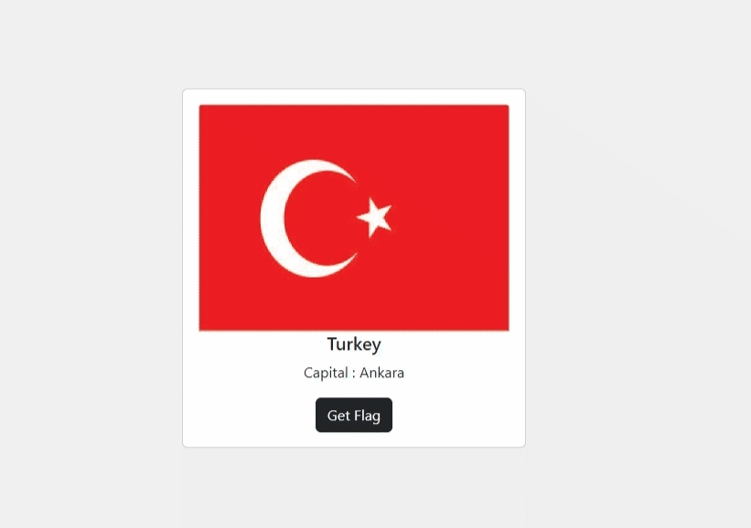
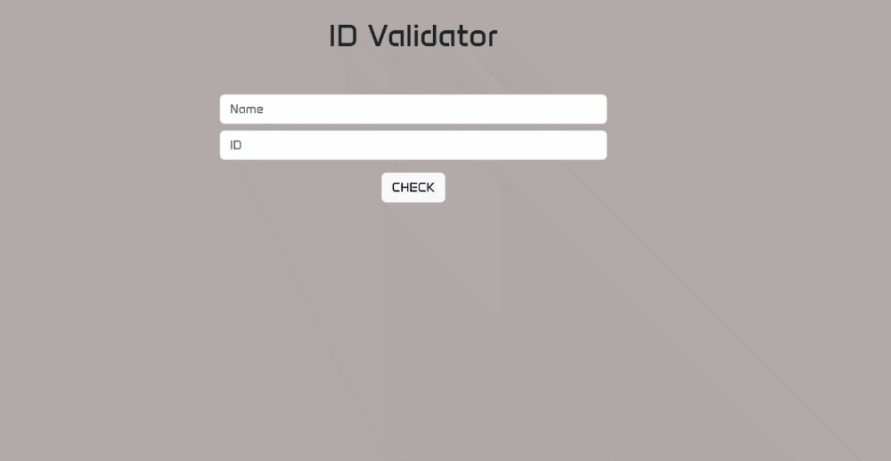
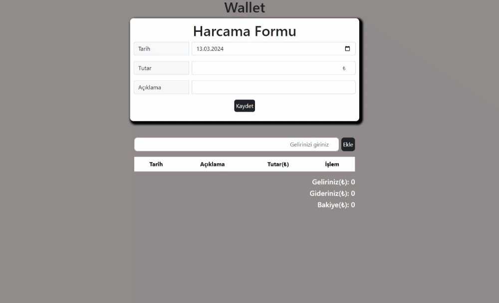
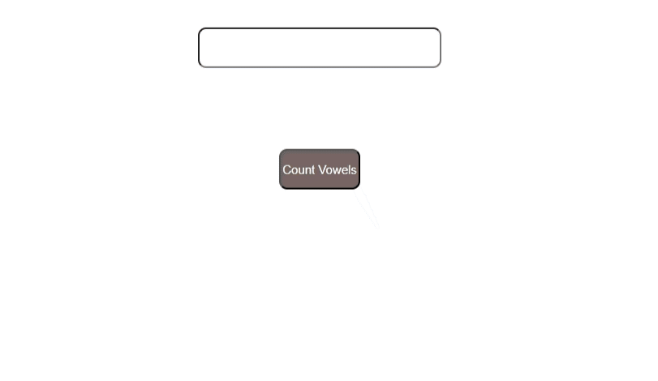
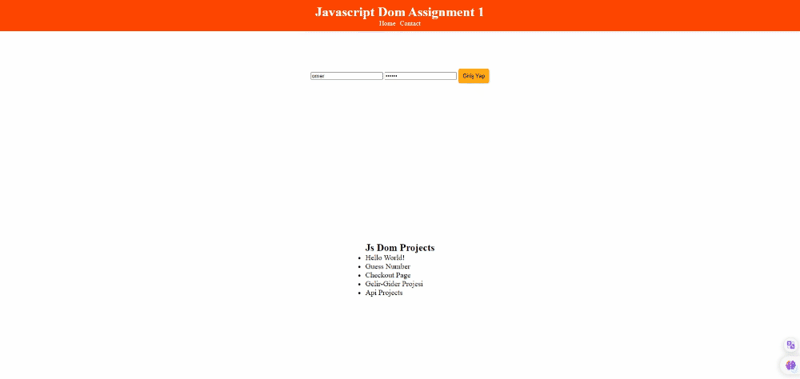
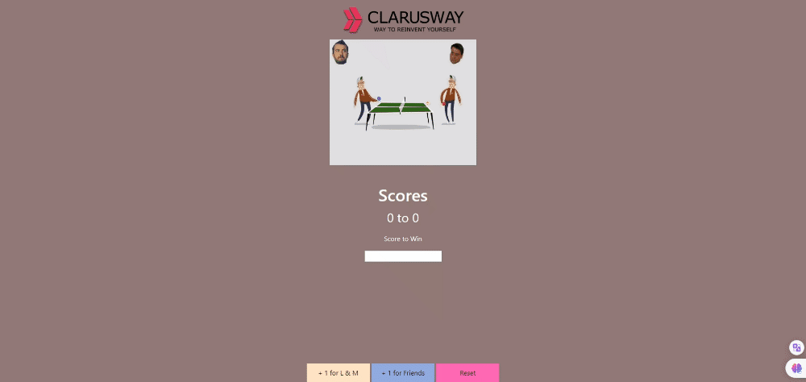

This is my CW - area. And, There are my studies in here.
---------------------------------------------------------------------------------------------------

##                                                                 <b>JAVASCRİPT<b> Tasks

## #15 https://omerfaruk2626.github.io/CW-Area/js/Tasks/random_flag/  // Using the API that contains information about the countries, I pulled random information and pressed it to the screen. 
## #14 https://omerfaruk2626.github.io/CW-Area/js/Tasks/stopWatch/  // This is a simple web-based timer implemented using HTML, CSS, and JavaScript. It allows users to start, stop, and reset the timer with buttons. The timer displays tenths of a second, seconds, and minutes. 
## #13 https://omerfaruk2626.github.io/CW-Area/js/Tasks/random_cat/  // I randomly pulled the image links from the API and printed them on the page. It was one of the starter studies of the API study. 
## #12 https://omerfaruk2626.github.io/CW-Area/js/Tasks/validator/  // This task involves creating a form validation script using JavaScript. It includes checking various form fields for correctness before submission. 
## #11 https://omerfaruk2626.github.io/CW-Area/js/Tasks/idvalidator/  // I created a JavaScript project for validating Turkish Republic Identification Numbers (T.C. Kimlik Numarası). The application verifies the format and overall validity of these identification numbers, offering a concise tool for accurate validation.  
## #10 https://omerfaruk2626.github.io/CW-Area/js/Tasks/wallet/  // This task involves implementing a simple wallet management system using JavaScript. Users could add or subtract funds, and the application displays the current balance.  
## #9 https://omerfaruk2626.github.io/CW-Area/js/Tasks/vowels/  // This project involves counting the number of vowels in a given text using JavaScript. It includes a user interface for inputting text and displaying the result.  
## #8 https://omerfaruk2626.github.io/CW-Area/js/Tasks/todolist/  // This task involves creating a to-do list application using JavaScript. Users can add tasks, mark them as completed, and potentially perform other actions.  
## #7 https://omerfaruk2626.github.io/CW-Area/js/Tasks/checkout/  // This project is related to creating a checkout form for an online store using JavaScript. It involves form validation and handling user input.  
## #6 https://omerfaruk2626.github.io/CW-Area/js/Tasks/dom1/  // I did a rework and reinforcement project on DOM. 
## #5 https://omerfaruk2626.github.io/CW-Area/js/Tasks/score_keeper/  // I have developed a score-keeping application using JavaScript, and the scores are dynamically reflected on the screen through the Document Object Model (DOM).  
## #4 https://omerfaruk2626.github.io/CW-Area/js/Tasks/guess_2/  // Similar to Task #0, this project is an advanced version of a guessing game. It includes HTML-CSS-JAVASCRIPT.  
## #3 https://omerfaruk2626.github.io/CW-Area/js/Tasks/seasons/  // This task involves determining the season based on the input of a month. JavaScript is used to evaluate the month and determine the corresponding season.  
## #2 https://omerfaruk2626.github.io/CW-Area/js/Tasks/leap_year/  // This project checks whether a given year is a leap year or not. JavaScript is used to implement the logic for leap year calculations.  
## #1 https://omerfaruk2626.github.io/CW-Area/js/Tasks/js-4işlem/  // This task involves implementing basic arithmetic operations (addition, subtraction, multiplication, division) using JavaScript. The user inputs two numbers, and the script displays the results of these operations. I improved the javascript work  
## #0 https://omerfaruk2626.github.io/CW-Area/js/Tasks/guess/  // This project involves a guessing game where the user tries to guess a randomly generated number. JavaScript is used to handle the logic of generating a random number and processing user input. 

---------------------------------------------------------------------------------------------------

##  <b>HTML-CSS<b> Tasks

## #13 https://omerfaruk2626.github.io/CW-Area/html_css/Tasks/boostrap/  // The webpage demonstrates the use of Bootstrap, a popular front-end framework. It showcases responsive design elements and components provided by Bootstrap for creating a visually appealing and mobile-friendly layout.  
## #12 https://omerfaruk2626.github.io/CW-Area/html_css/Tasks/productcard/  // On this page, I simply cloned the apple page. I added new ideas to myself.  
## #11 https://omerfaruk2626.github.io/CW-Area/html_css/Tasks/media_quare/  // The webpage involves creating a media square layout using HTML and CSS. It showcases images, videos, or other media elements in a structured square format.  
## #10 https://omerfaruk2626.github.io/CW-Area/html_css/Tasks/anthony/  // In this project, I improved myself by cloning the portfolio page.  
## #9 https://omerfaruk2626.github.io/CW-Area/html_css/Tasks/animation/  // The webpage focuses on demonstrating various animations using HTML and CSS. It includes transitions, keyframes, or other animation techniques to enhance the visual appeal of the content.  
## #8 https://omerfaruk2626.github.io/CW-Area/html_css/Tasks/grid3/  // This webpage demonstrates the use of CSS Grid layout. It showcases the capability of creating a structured grid-based design for organizing and presenting content.  
## #7 https://omerfaruk2626.github.io/CW-Area/html_css/Tasks/grid2/  // This webpage demonstrates the use of CSS Grid layout. It showcases the capability of creating a structured grid-based design for organizing and presenting content.  
## #6 https://omerfaruk2626.github.io/CW-Area/html_css/Tasks/grid/  // This webpage demonstrates the use of CSS Grid layout. It showcases the capability of creating a structured grid-based design for organizing and presenting content.  
## #5 https://omerfaruk2626.github.io/CW-Area/html_css/Tasks/Netflix/  // This project appears to be a Netflix homepage recreation. It showcases a layout resembling the Netflix interface, using HTML and CSS to mimic the design and structure of the popular streaming platform. 
## #4 https://omerfaruk2626.github.io/CW-Area/html_css/Tasks/Clarusway_info_page/  // The webpage is an information page for Clarusway, bootcamp. It includes details about Clarusway's offerings and uses HTML and CSS for the layout.  
## #3 https://omerfaruk2626.github.io/CW-Area/html_css/Tasks/gallery/  // This project is a gallery webpage displaying various images. It demonstrates the use of HTML and CSS to create a grid layout for showcasing a collection of pictures.  
## #2 https://omerfaruk2626.github.io/CW-Area/html_css/Tasks/home_furnishing/  // The webpage focuses on home furnishing, featuring different furniture items and design elements. It provides a visual representation of home decor using HTML and CSS.  
## #1 https://omerfaruk2626.github.io/CW-Area/html_css/Tasks/parallax/  // This project showcases a webpage with a parallax effect, where background images move at a different speed than the foreground, creating a visually appealing scrolling experience. 
## #0 https://omerfaruk2626.github.io/CW-Area/html_css/Tasks/stan-lee/   // I made a page with basic html css 

---------------------------------------------------------------------------------------------------

